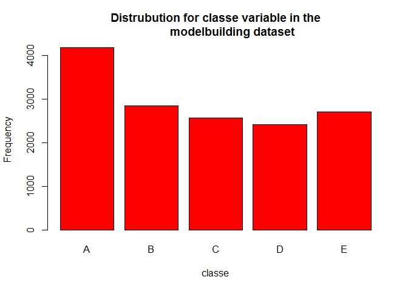
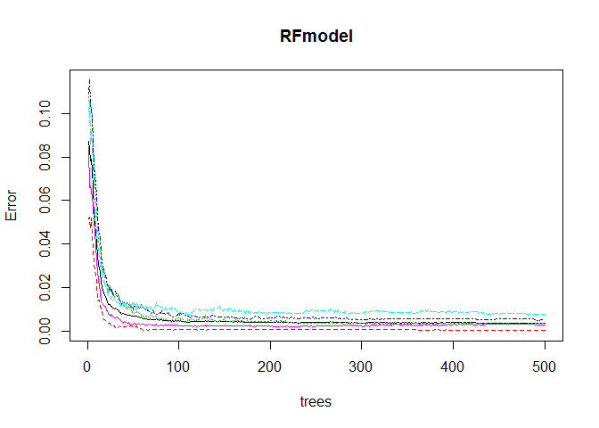
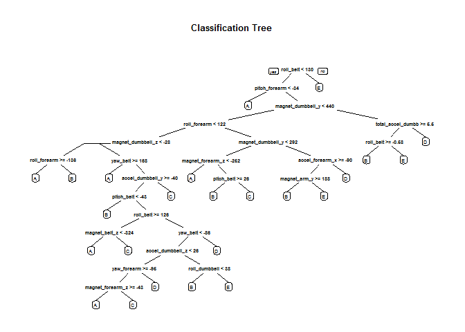

# Machine Learning
Birthe Marie Strand  
14. April 2016  
Final course project in Practical Machine Learning at Johns Hopkins University.  

Introduction
============
The goal of this project is to predict the manner in which the subjects did their exercise, that is to quantify how well they do it and not just how much exercise they did. This is the "classe" variable in the data set. The final selected model will be used to predict the outcome (classe) on 20 different test cases available in the test set. 


The data for this project come from this source: http://groupware.les.inf.puc-rio.br/har. 

Approach to the project
=======================
To ensure reprodusability a random seed is set. Random sub sampling is used for **crossvaladating**. The training set will be split into two, 75% training and 25% testing. The original test set will be put aside and only used to estimate which class the final model proposes the observation to relate to(file named Finaltest). 

The **models** will be build on the training sets and crossvaladating on the test set. Random Forest and Decision trees will be used as methods for building the 2 proposed models. **Out of sample error** will be evaluated by confusion matrix (1-accuracy). The model with the highest accuracy and lowest out of sample error will be chosen. 

Features(variables) that are irrelevant or have large amount of with missing values will be excluded. 

I choose to not use the caret package to build the models because they were extremely time demanding to run. 

 * **Steps in solving the assignment;** 
  + Loading packages and data
  + Cleaning data(excluding variables)
  + Creating datasets for crossvaledating
  + Build and cross validating Random Forest model
  + Build and cross validating Decision Tree model
  + Final model selection


###Loading and preparing the data

The analysis start with the raw csv data which is load from the webpage. The data is only downloaded if its not already done. (Make sure to set your working directory and make the necessary adjustments to the path specified below). Some of the commands for exploring the data set are set inactive in this document to compress the document size (like head, summary of data set etc.). 

We start of by loading the necessary packages and the raw data. In addition the seed is set overall for reprodusability.

```r
library(caret)
```

```
## Loading required package: lattice
```

```
## Loading required package: ggplot2
```

```r
library(randomForest)
```

```
## randomForest 4.6-12
```

```
## Type rfNews() to see new features/changes/bug fixes.
```

```
## 
## Attaching package: 'randomForest'
```

```
## The following object is masked from 'package:ggplot2':
## 
##     margin
```

```r
library(rpart) 
library(rpart.plot) 

set.seed(1100)

  Training <- read.csv("https://d396qusza40orc.cloudfront.net/predmachlearn/pml-training.csv", 
                        na.strings=c("NA","#DIV/0!", ""))


  Finaltest <- read.csv('https://d396qusza40orc.cloudfront.net/predmachlearn/pml-testing.csv',
                       na.strings=c("NA","#DIV/0!", ""))

    ##str(Training)
    ##str(Finaltest)
    ##summary(Training)
    ##summary(Finaltest)
    dim(Training)
```

```
## [1] 19622   160
```

```r
    dim(Finaltest)
```

```
## [1]  20 160
```


###Cleaning data and excluding variables

In the section below variables that are unnecessary or contain large amounts of missing variables are deleted. It is also essential that the Finaltest set (20 observations that the final model is to predict the outcome of) is identical to the training set. Here the test set is used to set the standard for which features to include in the training set.  


```r
    features <- names(Finaltest[,colSums(is.na(Finaltest)) == 0])[8:59]

      Training <- Training[,c(features,"classe")]
      Finaltest <- Finaltest[,c(features,"problem_id")]

          dim(Training)
```

```
## [1] 19622    53
```

```r
          dim(Finaltest);
```

```
## [1] 20 53
```


###Creating datasets for crossvaledating

To be able to cross validate the models the training set is split into two, with 75% of the cases reserved for building the model on and 25% for testing the model. A table and a plot is also generated to view the distribution of Classe, which is the variable that the models are built to predict.  


```r
    Subsets <- createDataPartition(y=Training$classe, p=0.75, list=FALSE)
        SubTraining <- Training[Subsets, ] 
        SubTesting <- Training[-Subsets, ]
            dim(SubTraining)
```

```
## [1] 14718    53
```

```r
            dim(SubTesting)
```

```
## [1] 4904   53
```

```r
      table(SubTraining$classe)
```

```
## 
##    A    B    C    D    E 
## 4185 2848 2567 2412 2706
```

```r
      plot(SubTraining$classe, col="red", main="Distrubution for classe variable in the
           modelbuilding dataset", xlab="classe", ylab="Frequency")
```



###Build and crossvalidating Random forest model


```r
    RFmodel <- randomForest(classe ~. , data=SubTraining, method="class")
        plot(RFmodel)
```



```r
        ##Results of spesific tree hidden due to space constrains
        ##getTree(RFmodel, k=2)
        
    RFprediction <- predict(RFmodel, SubTesting, type = "class")
        confusionMatrix(RFprediction, SubTesting$classe)
```

```
## Confusion Matrix and Statistics
## 
##           Reference
## Prediction    A    B    C    D    E
##          A 1395    2    0    0    0
##          B    0  946   11    0    0
##          C    0    1  843    6    0
##          D    0    0    1  797    3
##          E    0    0    0    1  898
## 
## Overall Statistics
##                                           
##                Accuracy : 0.9949          
##                  95% CI : (0.9925, 0.9967)
##     No Information Rate : 0.2845          
##     P-Value [Acc > NIR] : < 2.2e-16       
##                                           
##                   Kappa : 0.9936          
##  Mcnemar's Test P-Value : NA              
## 
## Statistics by Class:
## 
##                      Class: A Class: B Class: C Class: D Class: E
## Sensitivity            1.0000   0.9968   0.9860   0.9913   0.9967
## Specificity            0.9994   0.9972   0.9983   0.9990   0.9998
## Pos Pred Value         0.9986   0.9885   0.9918   0.9950   0.9989
## Neg Pred Value         1.0000   0.9992   0.9970   0.9983   0.9993
## Prevalence             0.2845   0.1935   0.1743   0.1639   0.1837
## Detection Rate         0.2845   0.1929   0.1719   0.1625   0.1831
## Detection Prevalence   0.2849   0.1951   0.1733   0.1633   0.1833
## Balanced Accuracy      0.9997   0.9970   0.9921   0.9952   0.9982
```

```r
    RFpredictfinal <- predict(RFmodel, Finaltest, type="class")
        RFpredictfinal
```

```
##  1  2  3  4  5  6  7  8  9 10 11 12 13 14 15 16 17 18 19 20 
##  B  A  B  A  A  E  D  B  A  A  B  C  B  A  E  E  A  B  B  B 
## Levels: A B C D E
```

```r
        summary(RFpredictfinal)
```

```
## A B C D E 
## 7 8 1 1 3
```
        

**Prelimenary concusion**

The accuracy of the model is extremely high 0.9945 which would give us an out of sample error 1- 0.9945 = 0.005.
The plot of error rates over 500 trees also visualizes that the error rate is below 0.05 for all 5 classes. 


###Build and crossvalidating Decision Tree model


```r
    DTmodel <- rpart(classe ~ ., data=SubTraining, method="class")
        rpart.plot(DTmodel, main="Classification Tree")
```



```r
    DTprediction <- predict(DTmodel, SubTesting, type = "class")
        confusionMatrix(DTprediction, SubTesting$classe)
```

```
## Confusion Matrix and Statistics
## 
##           Reference
## Prediction    A    B    C    D    E
##          A 1251  144   10   34   22
##          B   42  602   77   63   85
##          C   34   91  676  122  123
##          D   46   63   60  516   46
##          E   22   49   32   69  625
## 
## Overall Statistics
##                                          
##                Accuracy : 0.7484         
##                  95% CI : (0.736, 0.7605)
##     No Information Rate : 0.2845         
##     P-Value [Acc > NIR] : < 2.2e-16      
##                                          
##                   Kappa : 0.6813         
##  Mcnemar's Test P-Value : < 2.2e-16      
## 
## Statistics by Class:
## 
##                      Class: A Class: B Class: C Class: D Class: E
## Sensitivity            0.8968   0.6344   0.7906   0.6418   0.6937
## Specificity            0.9402   0.9325   0.9086   0.9476   0.9570
## Pos Pred Value         0.8563   0.6928   0.6463   0.7059   0.7842
## Neg Pred Value         0.9582   0.9140   0.9536   0.9310   0.9328
## Prevalence             0.2845   0.1935   0.1743   0.1639   0.1837
## Detection Rate         0.2551   0.1228   0.1378   0.1052   0.1274
## Detection Prevalence   0.2979   0.1772   0.2133   0.1491   0.1625
## Balanced Accuracy      0.9185   0.7834   0.8496   0.7947   0.8254
```

```r
    DTpredictfinal <- predict(DTmodel, Finaltest, type="class")
        DTpredictfinal
```

```
##  1  2  3  4  5  6  7  8  9 10 11 12 13 14 15 16 17 18 19 20 
##  B  A  B  D  A  C  D  A  A  A  C  B  C  A  E  E  A  B  B  B 
## Levels: A B C D E
```

```r
        summary(DTpredictfinal)
```

```
## A B C D E 
## 7 6 3 2 2
```
**Prelimenary conclusion**

The accuracy of the model is rather low 0.7484 which would give us an out of sample error of 1-0.7484= 0.25216. 


###Final model selection

The model using random forest gives the highest accuracy of 0.99 as apposed to 
decision tree only has an accuracy of 0.74. The Random Forest model is without doubt the preferd model and will give us an expected out of sample error on 5% as apposed to the Decision tree model which will have an out of sample error on 25%. The model is best at predicting Class A (exercise done according to specifications ) and class E (throwing the hips to the front). Class C (lifting the dumbbell only half way)is the level that has the lowest accuracy .
